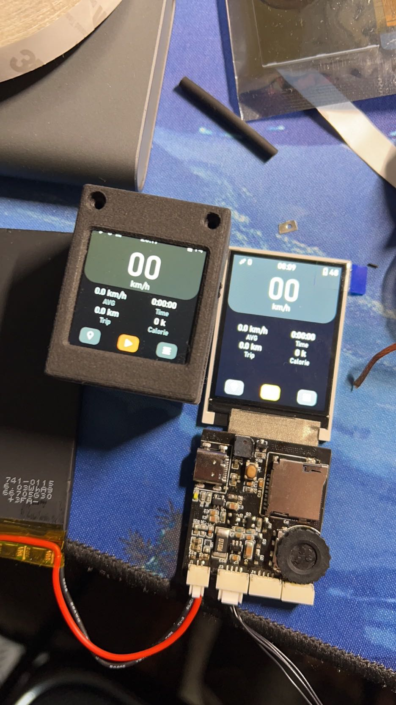

# X-Track - 2.0英寸PCB
感谢@FASTSHIFT的开源项目X-TRACK
此版本PCB布局参照[X-TRACK_LQFP](https://github.com/johnsbark/X-TRACK_LQFP)项目布局

## 硬件改动
* 使用四层PCB，方便走线，PCB厚度 *1.6mm*
* 串口线片更换为 *CP2102*
* IMU更换为 *MPU6050*
* 地磁极更换为 *QMC6310* (芯片封装极其不利于焊接，考虑之后替换为QMC5883)
* 增加了电池电量计 *BQ27220*, 由于电量计是ROM-Base, 固件需要通过SD卡持久化保存电量计数据
* PCB接口由原来的焊盘更换为 *GH1.25*, 方便安装
* USB接口更换为Type-C
* 电源网络使用覆铜覆盖
* 充电芯片挪至PCB背面，可以更好的散热
* GPS模块内部集成了LDO, 因此将GPS模块VCC直接接电池减小*3.3v LDO*负载
* 充电指示灯挪至边缘

## 注意事项
* 由于地线和电源线均采用覆铜走线，对烙铁焊接不够友好，建议使用 **低温锡膏** 加 **风枪** 方式焊接。
* 焊接最好使用延长排线加长屏幕排线，方便安装进外壳
* *BQ27220* 电量计是可选项，BGA封装对焊接不够友好，新手不推荐安装
