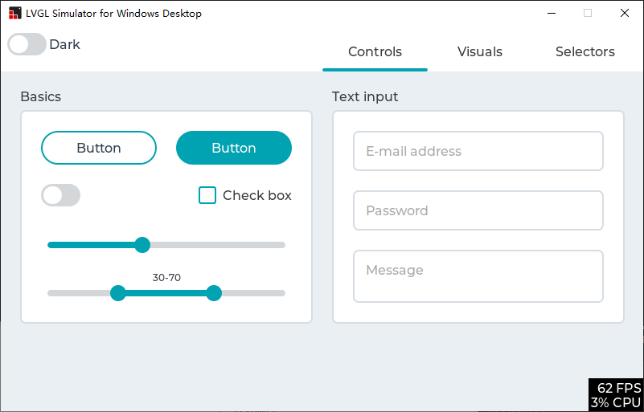

# LVGL - PC Simulator using Visual Studio



## Introduction

This is a pre-configured Visual Studio project to try LVGL on a Windows PC. The
project only depend on Win32 API, C Runtime and C++ STL, so you can compile it
without any extra dependencies.

The project is currently maintained using Visual Studio 2019. It may well work
without modification in Visual Studio 2017 but it is not actively supported 
with that version, so please install and test with Visual Studio 2019 before 
reporting any bugs.

Some one will notice that this repository had been renamed from 
`lv_sim_visual_studio_sdl` to `lv_sim_visual_studio`. You can read 
[here](https://github.com/lvgl/lvgl/issues/2043) and know why.

**This project is not for Visual Studio Code, it is for Visual Studio 2019.**

Instructions for cloning, building and running the application are found below.

## Supported Features

This repo is designed for keeping the simulator behavior. If you wonder to 
adapt your LVGL application to Windows, please visit 
[lvgl/lv_port_windows](https://github.com/lvgl/lv_port_windows).

- [x] Only depends on Win32 API, C Runtime and C++ STL.
- [x] Native support for x86, x64, ARM and ARM64 Windows.
- [x] Support compiling with [VC-LTL](https://github.com/Chuyu-Team/VC-LTL) 
      toolchain to make the binary size as smaller as using MinGW.
- [x] Support Per-monitor DPI Aware.
- [x] Support Windows keyboard and mouse wheel event in the HAL level.

## How to Clone

This repository contains other, necessary LVGL software repositories as 
[git submodules](https://git-scm.com/book/en/v2/Git-Tools-Submodules). Those 
submodules are not pulled in with the normal git clone command and they will be
needed. There are a couple of techniques to pull in the submodules.

### Everything at Once

This command will clone the lv_sim_visual_studio repository and all submodules
in a single step.

```
git clone --recurse-submodules https://github.com/lvgl/lv_sim_visual_studio.git
```

### Main Repository First, Submodules Second

If you've already cloned the main repository you can pull in the submodules 
with a second command. Both commands are shown below.

```
git clone https://github.com/lvgl/lv_sim_visual_studio.git
cd lv_sim_visual_studio
git submodule update --init --recursive
```

### Keeping Your Clone Up-To-Date

If you have cloned this repository and would like to pull in the latest 
changes, you will have to do this in two steps. The first step will pull in
updates to the main repo, including updated _references_ to the submodules. The
second step will update the code in the submodules to match those references.
The two commands needed to accomplish this are shown below, run these commands
from inside the main repository's directory (top level `lv_sim_visual_studio`
directory works fine).

```
git pull
git submodule update --init --recursive
```

If you have chosen to fork this repository then updating the fork from upstream
will require a different, more involved procedure.

## How To Build & Run

Open the `LVGL.Simulator.sln` solution file in Visual Studio. Set the 
`LVGL.Simulator` project as the startup project. Click on the `Local Windows
Debugger` button in the top toolbar.  The included project will be built and 
run, launching from a cmd window.

## Trying Things Out

There are a list of possible test applications in the 
[LVGL.Simulator.cpp](LVGL.Simulator/LVGL.Simulator.cpp) file. Each test or demo
is launched via a single function call.  By default the `lv_demo_widgets` 
function is the one that runs, but you can comment that one out and choose any
of the others to compile and run.

Use these examples to start building your own application test code inside the
simulator.

## A Note About Versions

This repository has its submodule references updated shortly afk with minor 
version updates. When submodule updates take place a matching version tag is
added tter the release of new, major releases of LittlevGL's core 
[lvgl](https://github.com/lvgl/lvgl) project. Occasionally it is updated to
woro this repository.

If you need to pull in bug fixes in more recent changes to the submodules you
will have to update the references on your own. If source files are added or
removed in the submodules then the visual studio project will likely need
adjusting. See the commit log for examples of submodule updates and associated
visual studio file changes to guide you.
